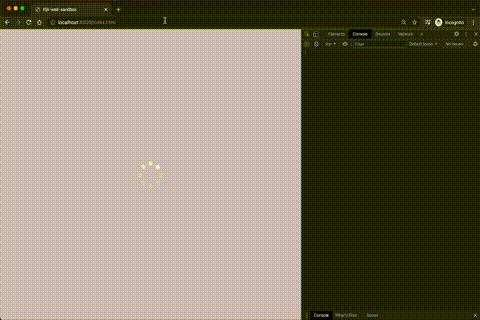
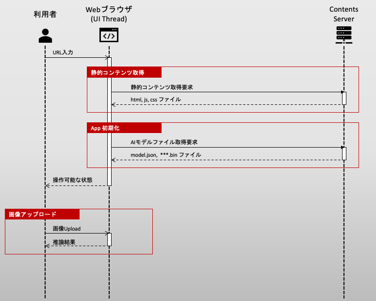

# このシリーズの目的

弊社は、独自開発したAIモデルをWebアプリに組み込み、プラットフォームによらず幅広いユーザが利用できるプロダクトを開発してきました。

「AIモデルをブラウザ上で動作させる」というプロダクト開発の過程で、以下のような課題に取り組む必要がありました。

- AI推論という高負荷な計算処理を、UI描画処理を妨げずに行う必要がある。（ユーザのUI操作を阻害しないため）
- AIモデルはファイルサイズが大きいため、ネットワーク経由でのダウンロードは極力減らす必要がある。（ユーザの初回画面表示時の待機時間を減らすため）
- クライアントPCのハードウェア性能によらずに、AI推論処理を高速に動作させる必要がある。 (GPUリソースを持たないPCでも許容できる動作速度を担保するため)

これらの課題を解決するため、Web Worker, Indexed DB などの比較的新しい Web API であったり、 TensorFlow.js の Web-Assembly バックエンド等の仕様を調査・適用し、プロダクトに活用してきました。

Web アプリ開発の界隈でも有用な情報になるかなと思い、日本語の記事にはなかなか見当たらなかったので、
整理も踏まえてこちらにまとめようというものです。

以下のテーマは少なくとも整理したいと思うので、シリーズものになると思います。

- TensorFlow.js + WASM でCPU環境でも高速なWebアプリを作る
- ブラウザ上のAI推論タスクを Web Worker でUIスレッドと分離する
- AIモデルを IndexedDB でブラウザにキャッシュする

整理しながら作っていきますので、気楽にお待ちいただけたら嬉しいです。

## シリーズを通して扱うサンプルアプリ

以下のようなアプリをサンプルとして扱いたいと思います。



gifでわかりにくくてすみません。仕様は文章で書くと、以下のようなものです。

- 入力:
  - ローカルに存在する画像ファイルを一つ選択する。
- 出力:
  - 入力画像ファイルに対して、以下の推論処理を行う。
    - 骨格推定モデル (posenet) で推論を行う。
    - 物体検知モデル (mobilenet) で推論を行う。
  - 推論結果のラベルとスコアを、画面に表示する。


## アプリ起動時のシーケンス・ダイアグラム

上記のサンプルアプリの一番原始的なシーケンス図を以下に示します。



登場しているアクターは、「利用者」「Webブラウザ」「コンテンツサーバ」の３つです。

ここで注意したいのは、Webブラウザは、通常はスレッド一つで処理を行うということです。
つまり、通常はスレッド一つで、画面の描画処理や推論処理といった計算を同時に行うことになります。

JavaScript には Promise 等の擬似的な非同期処理の仕組みがあるのはご存じの方が多いと思いますが、
それは通信の応答待ちなどWebブラウザが計算タスクを持たない場合にUIを阻害しないための仕組みであって、
AI初期化や推論などWebブラウザ側で本当にやるべき計算がある場合には、結局UI処理を阻害してしまうことに注意してください。

したがって、このシーケンスでは、ユーザがWebブラウザを開いてから操作可能な画面が帰ってくるまでの間、
ユーザはブラウザの画面が固まっている状態を体験してしまうことになります。

この問題に対しては、別の記事で説明する Web Worker を用いたスレッド分離で解決しますが、
いまはひとまずアプリの骨組みを作るところまで進めましょう。


## ソフトウェア・アーキテクチャ

まずアプリの骨組みとなる、クラス設計を行います。

ここでは、いわゆる Model-View-Presenter モデルを採用し、画面表示と描画ロジック、そしてAI処理を完全に分離することを目指します。

依存関係を明示したクラス図は以下のようになります。


それぞれの役割は、

| 要素 | 役割 |
| --- | ------- |
| Model | 画像データを受け取り、推論を行い、推論結果を返す。 |
| View | Presenterからの描画指示を受けて、描画する。また、UIイベントが発生したら処理を Presenter に委譲する。 |
| Presenter | 描画ロジックを実行し、View に描画指示を行う。 |

と定めます。ポイントは、TensorFlow.js を始めとする AIで必要なライブラリはすべて Model の領域で閉じ込めるようすることです。
これにより、AIの推論処理と、UI処理が完全に分離され、AI部分の改善に対しても改修範囲をModel内部に局所化することができます。


## フレームワーク・ライブラリ

実装に関連するライブラリ選定をしておきます。

まずフロントエンドのプロダクト開発で型付き言語は必須なので Typescript を前提にします。

また、この記事はUIフレームワークに依存したものにしたくないので、React, Vue.js, Angular 等のライフサイクルを司るフレームワークは利用しません。
ただし、先に示したソフトウェア・アーキテクチャを実現する上で、Dependency Injection 機構は必須なので、
DIコンテナライブラリとして inversify.js を利用します。

AIライブラリとしては TensorFlow.js と、今回利用するpre-trained モデル `@tfjs/posenet` と `@tfjs/mobilenet` を利用します。

結局 `package.json` は以下のようになりました。

```json
{
  "name": "tfjs-web-sandbox",
  "version": "1.0.0",
  "description": "",
  "main": "index.js",
  "scripts": {
    "build": "esbuild --bundle ./src/index.ts --outfile=./www/index.js",
    "start": "yarn build --servedir=./www"
  },
  "author": "",
  "license": "ISC",
  "devDependencies": {
    "esbuild": "^0.14.9",
    "typescript": "^4.4.4"
  },
  "dependencies": {
    "@tensorflow-models/mobilenet": "^2.1.0",
    "@tensorflow-models/posenet": "^2.2.2",
    "@tensorflow/tfjs": "^3.12.0",
    "inversify": "^6.0.1",
    "reflect-metadata": "^0.1.13"
  }
}
```

## 学習済のfrozen model(.pb)をWebモデルに変換する

実装に入る前に、今回利用するモデルをTensorFlow.jsで取込可能なWebモデルに変換する必要があります。

この解説では、.pb形式のTensorFlow frozen model形式を、事前に学習・作成済と仮定します。
Keras、PyTorch等のフレームワークによってモデルの形式が異なりますが、それらの詳細は別途解説記事に回したいと思います。

さて、posenet や mobilenet の事前学習モデルを例えば[ここ](https://github.com/tensorflow/models/blob/master/research/slim/nets/mobilenet_v1.md)から入手したとしましょう。

.pb形式のファイルからWebモデルに変換するには `tensorflowjs_converter` を利用します。

```
$ pip install tensorflowjs_converter
```

例えば `mobilenet` を変換したい場合は以下のように指定すると、 `./web` フォルダ配下に `model.json` ファイルと、Webモデルのバイナリファイルが配置されます。

```
$ tensorflowjs_converter \
  --input_format=tf_frozen_model \
  --output_node_names='MobilenetV1/Predictions/Reshape_1' \
  ./frozen/mobilenet_v1_1.0_224_frozen.pb ./web   
```

`--output_node_names`オプションには、モデルの出力ノード名称を指定する必要がありますので、入力モデルのアーキテクチャを確認して正しく設定してください。


## Model部分の実装

それでは、AI部分の実装を始めていきましょう。

まず、Modelの役割を果たす `CombinedDetector` のインターフェースを、以下のように決めます。

```typescript
// file path: app/model/combined-detector/ICombinedDetector.ts

export interface ICombinedDetectorOutput {
  pose: string
  ssd: string
}

export interface ICombinedDetector {
  load(): Promise<boolean>
  detctFromImage(input: ImageData): Promise<ICombinedDetectorOutput>
}
```

つまり、`CombinedDetector` クラスは、モデルをロードしてその結果をbooleanで返す機能(`load`)と、 入力となる画像データを受け取って推論結果を`string`の連想配列で返す機能(`detectFromImage`)を持つこととします。 

### 実装: `load` 

AIモデルを TensorFlow.js の枠組みでロードするには

- まず `TensorFlow.js` を初期化し、バックエンドを設定する
- 次に、利用するモデルファイルをメモリにロードする
- 最後に、ロードしたモデルファイルにダミー入力を渡して WarmUp する

の手順が必要になります。最後の WarmUp は、経験上、あったほうが安心感がありますが、基本的に無くてもエラーにはならないので、ご参考までに。

以上を踏まえて、`load` の実装は以下のようになります。

```typescript
// file path: app/model/combined-detector/impl/CombinedDetector.ts

@injectable()
export class CombinedDetector implements ICombinedDetector {

  private poseNet: posenet.PoseNet | undefined;
  private mobileNet: mobilenet.MobileNet | undefined;

  ...

  async load(): Promise<boolean> {
    // prepare tfjs
    await tf.ready();
    console.log("  tfjs backend=", tf.getBackend());

    // prepare posenet
    this.poseNet = await posenet.load({
      architecture: "MobileNetV1",
      inputResolution: { width: 320, height: 240 },
      outputStride: 16,
      modelUrl: '/models/posenet/web/model.json',
    })

    // prepare mobilenet
    this.mobileNet = await mobilenet.load({
      version: 1,
      alpha: 0.75,
      modelUrl: '/models/mobilenet/web/model.json',
    })

    // warm up
    await this.poseNet.estimateMultiplePoses(tf.zeros([320, 240, 3]));

    // warm up
    await this.mobileNet.classify(tf.zeros([320, 240, 3]));

    return true;
  }

  ...
}

```

まず load の一番最初の

```typescript
    // prepare tfjs
    await tf.ready();
    console.log("  tfjs backend=", tf.getBackend());
```

に注目してください。これは、TensorFlow.js を実行環境に合わせて最適なバックエンドで初期化している部分になります。
`tf.ready()` でバックエンドを選定し、`tf.getBackend()` で選定されたバックエンドを返します。
現状のセットアップでは、

- ハードウェアアクセラレータが実行できるWebブラウザ環境の場合は `webgl` バックエンドが選定される
- 上記以外の場合は、 `cpu` バックエンドが選定される

という動作になります。

次に、モデルのロードを

```typescript
    // prepare posenet
    this.poseNet = await posenet.load({
      architecture: "MobileNetV1",
      inputResolution: { width: 320, height: 240 },
      outputStride: 16,
      modelUrl: '/models/posenet/web/model.json',
    })
```

このように行っています。`modelUrl`に、先程 `tensorflowjs_converter` で生成したWebモデルのjsonのURLを指定することで、
コンテンツサーバに配置したWebモデルをロードできるようになります。


## 実装: `detectFromImage`

実装の前に、なぜ入力画像を `HTMLImageElement` 等のDOM要素ではなく、 `ImageData` 形式にしているのか、気になった方もあるかもしれません。
その理由は、後ほどWeb WorkerスレッドにAI処理を分離した際に、Web WorkerスレッドからDOMが読めないからなのですが、後ほど詳しく説明します。
いまはとりあえず、Modelレイヤの入力画像の形式は、全て `ImageData` に統一するというルールで実装することだけ注意してください。

さて推論パートの実装ですが、入力形式を `ImageData` 形式にすること以外は、特別なことはありません。
`posenet` と `mobilenet` は、事前学習モデルの利用者向けにAPIが提供されていますので、素直にそれを利用して、
以下のように作れます。

```typescript
// file path: app/model/combined-detector/impl/CombinedDetector.ts

@injectable()
export class CombinedDetector implements ICombinedDetector {

  ...

  async detctFromImage(input: ImageData): Promise<ICombinedDetectorOutput> {
    const posenetResult = this.poseNet ? await this.poseNet.estimateMultiplePoses(input) : [];
    const mobilenetResult = this.mobileNet ? await this.mobileNet.classify(input) : [];

    // 適当に推論結果を string 形式に出力しています
    return {
      pose: posenetResult.reduce((prev, curr) => prev + `[pose](score=${curr.score.toFixed(2)}); `, ""),
      ssd: mobilenetResult.reduce((prev, curr) => prev + `[${curr.className}](score=${curr.probability.toFixed(2)});`, ""),
    };
  }
}
```


さて、以上で AI部分の実装は完了しました。

あとは、Presenter と View を実装するだけですが、このUI関連部分の実装はこのシリーズの解説の目的からはずれてくるので、あえて説明しません。
実装することは
- 画面のロード時に Presenter 経由で `CombinedDetector.load` を呼び出す
- 入力ファイルのアップロード完了イベントをフックし、 Presenter 経由で `CombinedDetector.detectFromImage` を呼び出す
くらいです。設計思想のところで話したように、画面の実装と AIモデルの実装は完全に分離できていますので、UI側の実装はご利用のUIフレームワーク等を踏まえて当てはめてみてください。

## 現時点での問題点

さて、以上をもちまして、初期的なサンプルアプリの実装は完了しました。
ですが、解説の途中で何度も不満を述べたものも含めて以下の課題が明らかになります。

- 課題1. 画面の初回ロード中に、インジケータCSSのような動的なUIが、カクついてしまう。
- 課題2. 初回ロードで、いつもモデルファイルをダウンロードするのでネットワーク負荷が高い。
- 課題3. ハードウェアアクセラレータ付きの環境では、TensorFlow.jsバックエンドが`webgl`に設定され、高速に処理できる一方で、そうでない環境においてはバックエンドは`cpu`となり、実行速度が許容できないレベルで遅くなる。

これらに対応するため、今回作った初期的なサンプルアプリのAI部分を改善していきます。
